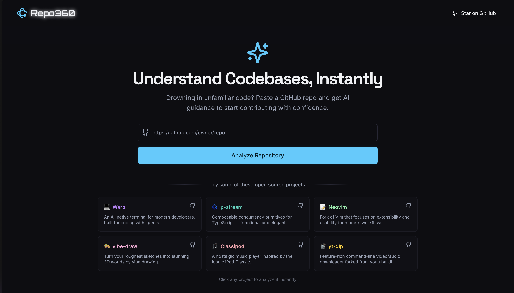
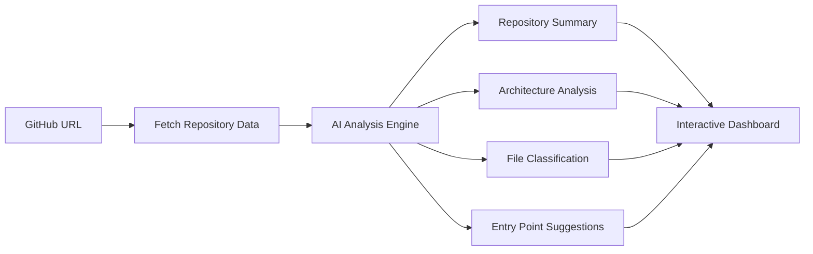

# Repo360

**Understand any codebase, instantly.**

Repo360 is an AI-powered repository analyzer that transforms overwhelming codebases into clear, digestible insights. Simply paste a GitHub URL and get instant architectural breakdowns, file explanations, and guided exploration paths.

Demo Video - [https://youtu.be/LAD-kBDGYUk](https://youtu.be/LAD-kBDGYUk)


> Inspired by [GitDiagram](https://gitdiagram.com) by [Ahmed](https://github.com/ahmedkhaleel2004) - Another great tool for visualizing Git repositories!

## Why Repo360?

**The Problem**: Joining a new project or exploring open-source repositories can be overwhelming. Developers spend hours just figuring out where to start, what each file does, and how components connect.

**The Solution**: Repo360 uses AI to instantly analyze repositories and provide:

- 📊 **Architecture Overview**: Visual component diagrams showing how your app is structured
- 🎯 **Smart Entry Points**: AI-prioritized list of files to read first
- 📝 **File Explanations**: Natural language descriptions of what each file does
- 🔍 **Interactive Exploration**: Click-to-explore interface with direct GitHub links
- 🎨 **Visual Project Gallery**: Screenshots and demos from README files

## 🎮 Usage

1. **Enter a GitHub URL** - Any public repository
2. **Click "Analyze Repository"** - AI processes the codebase
3. **Explore the Results**:
   - 📊 **Executive Summary**: Purpose, tech stack, setup instructions
   - 🏗️ **Architecture Diagram**: Visual component breakdown
   - 📁 **File Explorer**: Prioritized reading list with AI explanations
   - 🖼️ **Project Gallery**: Screenshots and demos
   - 🔧 **Tools**: Environment scanner, file classifier

## 🛠️ Tech Stack

### **Frontend**

- **Next.js 15** - React framework with App Router
- **TypeScript** - Type-safe development
- **Tailwind CSS** - Utility-first styling
- **Framer Motion** - Smooth animations and interactions
- **Radix UI** - Accessible component primitives
- **React Hook Form + Zod** - Form handling and validation

### **AI & Backend**

- **Google Gemini AI** - Advanced language model for code analysis
- **Firebase Genkit** - AI development framework
- **GitHub API (@octokit/rest)** - Repository data fetching

### **UI/UX**

- **Lucide React** - Beautiful icons
- **Custom Gaming Theme** - Vibrant colors and smooth animations
- **Space Grotesk & Orbitron** - Modern typography
- **Dark/Light Mode** - Full theme support

## How It Works



1. **Repository Fetching**: Securely fetch repository metadata, file structure, and key files
2. **AI Processing**: Multiple specialized AI agents analyze different aspects:
   - **Summarizer**: Creates executive summary with purpose, tech stack, and setup
   - **Architect**: Identifies components (frontend, backend, API, database) and their relationships
   - **File Classifier**: Categorizes files by importance and purpose
   - **Entry Point Finder**: Suggests optimal reading order for understanding the codebase
3. **Visual Presentation**: Transform analysis into interactive, explorable interface
4. **GitHub Integration**: Provide direct links to source files using correct repository branch

## 🚀 Getting Started

### Prerequisites

- **Node.js 18+** and **pnpm** (or npm/yarn)
- **GitHub Personal Access Token** (optional, for higher rate limits)
- **Google AI API Key** (for Gemini AI)

### Local Development

1. **Clone the repository**

   ```bash
   git clone https://github.com/gurkiratz/Repo360.git
   cd Repo360
   ```

2. **Install dependencies**

   ```bash
   pnpm install
   ```

3. **Environment setup**

   ```bash
   cp .env.example .env.local
   ```

   Add your API keys:

   ```env
   # Required: Google AI API Key
   GOOGLE_GENAI_API_KEY=your_google_ai_api_key_here

   # Optional: GitHub Token (increases rate limits)
   GITHUB_TOKEN=your_github_token_here
   ```

4. **Start development server**

   ```bash
   pnpm dev
   ```

5. **Open your browser**
   Navigate to `http://localhost:9002`

### Getting API Keys

#### Google AI API Key (Required)

1. Visit [Google AI Studio](https://aistudio.google.com/app/apikey)
2. Create a new API key
3. Add it to your `.env.local` as `GOOGLE_GENAI_API_KEY`

#### GitHub Token (Optional)

1. Go to [GitHub Settings > Developer settings > Personal access tokens](https://github.com/settings/tokens)
2. Generate a new classic token with `public_repo` scope
3. Add it to your `.env.local` as `GITHUB_TOKEN`

### Deployment

Deploy easily on Vercel, Netlify, or any platform supporting Next.js:

```bash
pnpm build
pnpm start
```

## Contributing

We welcome contributions! Please see our [Contributing Guide](CONTRIBUTING.md) for details.

1. Fork the repository
2. Create a feature branch (`git checkout -b feature/amazing-feature`)
3. Commit your changes (`git commit -m 'Add amazing feature'`)
4. Push to the branch (`git push origin feature/amazing-feature`)
5. Open a Pull Request

## 📄 License

This project is licensed under the MIT License - see the [LICENSE](LICENSE) file for details.

---

<div align="center">
  <strong>Built under 36 hours for <a href="https://hackthe6ix2025.devpost.com/">HackThe6ix 2025</a></a>  by <a href="https://github.com/gurkiratz">Gurkirat Singh</a></strong>
  <br>
  <sub>⚡ Fast Analysis • 🏆 AI Powered • 🎮 Gaming Inspired</sub>
</div>
